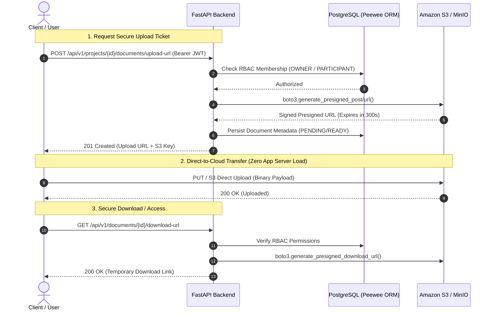

# 🚀 Cloud-Native Project & Document Management Microservice

[](https://www.python.org/)
[](https://fastapi.tiangolo.com/)
[](https://aws.amazon.com/s3/)
[](https://pytest.org/)
[](https://github.com/)
[](https://www.docker.com/)

A production-grade, asynchronous RESTful microservice built with **Python 3.12**, **FastAPI**, **PostgreSQL**, and **AWS S3 / MinIO**. Designed following **Domain-Driven Layered Architecture**, **Role-Based Access Control (RBAC)**, and strict **Test-Driven Development (TDD)** principles.

---

## 🏛️ System Architecture & Data Flow

This service offloads file transfer bottlenecks from application servers directly to **Amazon S3 Object Storage** using secure, cryptographically signed, short-lived **Presigned URLs**.



---

## 🌟 Key Architectural Features

- **Direct-to-Cloud Ingestion (AWS S3 / boto3):** Offloads multi-megabyte payloads from API web workers. Server memory and CPU are reserved purely for business logic.
- **Layered Clean Architecture:** Strict separation of concerns:
  - `app/api/`: Thin HTTP controllers, routing, and dependency injection (`Depends`).
  - `app/service/`: Pure domain business logic, state machines, and transactional invariants.
  - `app/repository/`: Data persistence abstraction over Peewee ORM.
  - `app/model/`: Relational entities, foreign keys, and cascading rules.
  - `app/schema/`: Pydantic v2 DTOs with automated whitespace trimming and strict validation.
- **Role-Based Access Control (RBAC):** Hierarchical workspace permissions (`OWNER`, `PARTICIPANT`) guarding project resources and document actions.
- **Cryptographic Project Invitations:** Time-bound (24h TTL), one-time-use token invitation lifecycle (`PENDING` -> `ACCEPTED` -> `REVOKED`) preventing user-enumeration and replay attacks.
- **Containerized Emulation (Docker & MinIO):** Fully reproducible local cloud development mimicking real AWS S3 APIs with zero external cloud cost.

---

## 🛠️ Technology Stack

| Domain | Technology | Purpose |
| :--- | :--- | :--- |
| **Language** | `Python 3.12` | Modern typing, high performance, match-case syntax |
| **Framework** | `FastAPI` | Asynchronous RESTful API framework with automatic OpenAPI docs |
| **Validation** | `Pydantic v2` | High-speed data parsing, serialization, and sanitization |
| **Database & ORM** | `PostgreSQL` & `Peewee` | Relational storage with connection pooling and schema management |
| **Cloud Storage** | `AWS S3 (boto3) / MinIO` | Scalable object storage with presigned upload/download authorization |
| **Security** | `python-jose` & `passlib` | JWT Bearer Authentication (`HTTPBearer`) and bcrypt password hashing |
| **Package Manager**| `Astral uv` | Blazing-fast virtual environment and dependency orchestration |
| **Testing** | `pytest`, `pytest-mock`, `moto` | Unit, service, and API integration testing with AWS isolation |

---

## 🚦 API Endpoints Overview

The API is fully documented via interactive **OpenAPI (Swagger UI)** at `/docs`.

```text
├── Auth Module
│   ├── POST   /api/v1/auth/register                   # User registration (Bcrypt hash)
│   └── POST   /api/v1/auth/login                      # JWT Bearer Token issuance
│
├── Projects Module (RBAC Protected)
│   ├── POST   /api/v1/projects/                       # Create workspace (auto-assigned as OWNER)
│   └── GET    /api/v1/projects/                       # List accessible workspaces
│
├── Project Invitations (Stateful Tokens)
│   ├── POST   /api/v1/projects/{id}/invitations       # Issue secure 24h invitation token
│   └── POST   /api/v1/invitations/{token}/accept      # Join workspace as PARTICIPANT
│
└── Cloud Document Management (S3)
    ├── POST   /api/v1/projects/{id}/documents/upload-url    # Request S3 Presigned Upload URL
    └── GET    /api/v1/documents/{id}/download-url          # Request S3 Presigned Download URL
```

---

## 🧪 Testing & Quality Assurance

This codebase is built around strict **Test-Driven Development (TDD)**. All AWS operations are safely intercepted and mocked using `moto`, ensuring tests run entirely offline with sub-second execution speeds.

```bash
# Run all unit, service, repository, and API integration test suites
uv run pytest -v
```

### Test Suite Metrics:
- **115+ Automated Tests** (100% Pass Rate)
- Full coverage across Database Models, Schema Validation, Service Business Rules, Security Exceptions, and HTTP Endpoints.

```text
tests/
├── api/          # FastAPI route integration & auth override tests
├── core/         # S3Client boto3 & JWT security utility tests
├── model/        # Peewee ORM constraints & cascading delete tests
├── repository/   # Data layer queries & transaction tests
└── service/      # RBAC authorization & invitation state machine tests
```

---

## ⚡ Quickstart & Local Setup

### Prerequisites
- Python 3.12+ and [uv](https://github.com/astral-sh/uv)
- Docker & Docker Compose

### 1. Clone & Setup Virtual Environment
```bash
git clone https://github.com/kaankara-dev/epam-python-specialization-project-management-demo-api.git
cd epam-python-specialization-project-management-demo-api

# Install dependencies with uv
uv sync
```

### 2. Start Cloud Storage Emulation (MinIO / S3)
```bash
# Start MinIO object storage container
docker compose up -d minio

# Initialize local S3 bucket
uv run python -m scripts.create_bucket
```

### 3. Run the Microservice
```bash
uv run uvicorn app.main:app --reload --port 8000
```
Open **`http://localhost:8000/docs`** to explore the live interactive Swagger UI.

---

## 👤 Author

**Kaan Kara**  
- **Background:** Physics Graduate (METU) | Cloud-Native Python Backend Engineer  
- **Certifications & Badges:** AWS Solutions Architect, AWS Cloud Practitioner, Google Cloud Gemini Enterprise Agent Specialist  
- **GitHub:** [@kaankara-dev](https://github.com/kaankara-dev)
