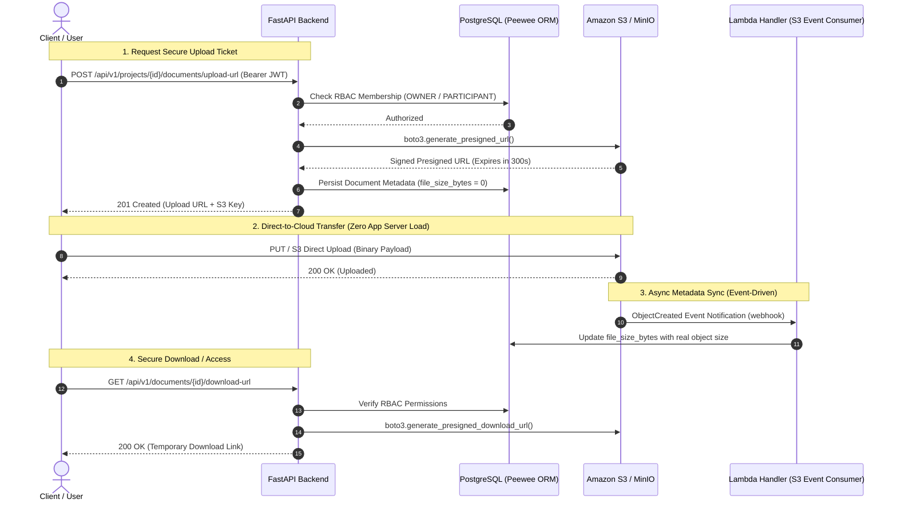

# 🚀 Cloud-Native Project & Document Management Microservice

[](https://github.com/kaankara-dev/epam-python-specialization-project-management-demo-api/actions/workflows/ci.yml)
[](https://www.python.org/)
[](https://fastapi.tiangolo.com/)
[](https://aws.amazon.com/s3/)
[](https://pytest.org/)
[](https://github.com/)
[](https://www.docker.com/)

A production-grade, asynchronous RESTful microservice built with **Python 3.12**, **FastAPI**, **PostgreSQL**, and **AWS S3 / MinIO**. Designed following **Domain-Driven Layered Architecture**, **Role-Based Access Control (RBAC)**, and strict **Test-Driven Development (TDD)** principles. Fully containerized: a single `docker compose up` boots the API, PostgreSQL, and an S3-compatible object store with event-driven metadata sync — no manual setup steps.

---

## 🏛️ System Architecture & Data Flow

This service offloads file transfer bottlenecks from application servers directly to **Amazon S3 Object Storage** using secure, cryptographically signed, short-lived **Presigned URLs**. An S3 event notification then triggers an asynchronous metadata update, mimicking a real AWS Lambda + S3 Event Notification pipeline.



---

## 🌟 Key Architectural Features

- **Direct-to-Cloud Ingestion (AWS S3 / boto3):** Offloads multi-megabyte payloads from API web workers. Server memory and CPU are reserved purely for business logic.
- **Event-Driven Metadata Sync:** A framework-agnostic Lambda-style handler (`app/lambda_handlers/`) consumes S3 `ObjectCreated` event notifications to reconcile real file sizes post-upload, decoupled from the request/response cycle.
- **Layered Clean Architecture:** Strict separation of concerns:
  - `app/api/`: Thin HTTP controllers, routing, and dependency injection (`Depends`).
  - `app/service/`: Pure domain business logic, state machines, and transactional invariants.
  - `app/repository/`: Data persistence abstraction over Peewee ORM.
  - `app/model/`: Relational entities, foreign keys, and cascading rules.
  - `app/schema/`: Pydantic v2 DTOs with automated whitespace trimming and strict validation.
- **Role-Based Access Control (RBAC):** Hierarchical workspace permissions (`OWNER`, `PARTICIPANT`) guarding project resources and document actions.
- **Cryptographic Project Invitations:** Time-bound (24h TTL), one-time-use token invitation lifecycle (`PENDING` -> `ACCEPTED` -> `REVOKED`) preventing user-enumeration and replay attacks.
- **Fully Containerized Local Cloud (Docker Compose):** One command (`docker compose up`) boots PostgreSQL, MinIO (S3-compatible storage), automated bucket/webhook provisioning, and the API itself — zero manual configuration, zero external cloud cost.
- **CI/CD Pipeline (GitHub Actions):** Every push runs lint (`ruff`) → test suite (`pytest`) → Docker image build, with the built image and the generated `openapi.json` schema published as workflow artifacts.

---

## 🛠️ Technology Stack

| Domain | Technology | Purpose |
| :--- | :--- | :--- |
| **Language** | `Python 3.12` | Modern typing, high performance, match-case syntax |
| **Framework** | `FastAPI` | Asynchronous RESTful API framework with automatic OpenAPI docs |
| **Validation** | `Pydantic v2` | High-speed data parsing, serialization, and sanitization |
| **Database & ORM** | `PostgreSQL` & `Peewee` | Relational storage with connection pooling and schema management |
| **Cloud Storage** | `AWS S3 (boto3) / MinIO` | Scalable object storage with presigned upload/download authorization |
| **Event Processing** | Lambda-style handler | AWS-Lambda-signature-compatible S3 event consumer, framework-agnostic |
| **Security** | `pwdlib` (Argon2) & `PyJWT` | JWT Bearer Authentication (`HTTPBearer`) and Argon2 password hashing |
| **Package Manager**| `Astral uv` | Blazing-fast virtual environment and dependency orchestration |
| **Containerization** | `Docker` & `Docker Compose` | Multi-stage builds, full local orchestration (API + DB + object storage) |
| **CI/CD** | `GitHub Actions` | Automated lint, test, and Docker build pipeline on every push |
| **Testing** | `pytest`, `pytest-mock`, `moto` | Unit, service, and API integration testing with AWS isolation |

---

## 🚦 API Endpoints Overview

The API is fully documented via interactive **OpenAPI (Swagger UI)** at `/docs`. The raw schema is also published as a `openapi.json` artifact on every CI run.

```text
├── Auth Module
│   ├── POST   /api/v1/auth/register                   # User registration (Argon2 hash)
│   └── POST   /api/v1/auth/login                      # JWT Bearer Token issuance
│
├── Projects Module (RBAC Protected)
│   ├── POST   /api/v1/projects/                       # Create workspace (auto-assigned as OWNER)
│   ├── GET    /api/v1/projects/                       # List accessible workspaces
│   ├── GET    /api/v1/projects/{id}                   # Get project detail (members only)
│   ├── PATCH  /api/v1/projects/{id}                    # Update project (OWNER only)
│   ├── DELETE /api/v1/projects/{id}                    # Delete project (OWNER only)
│   └── POST   /api/v1/projects/{id}/members            # Add project member (OWNER only)
│
├── Project Invitations (Stateful Tokens)
│   ├── POST   /api/v1/projects/{id}/invitations        # Issue secure 24h invitation token
│   └── POST   /api/v1/invitations/{token}/accept       # Join workspace as PARTICIPANT
│
├── Cloud Document Management (S3)
│   ├── POST   /api/v1/projects/{id}/documents/upload-url    # Request S3 Presigned Upload URL
│   ├── GET    /api/v1/projects/{id}/documents               # List documents of a project (members only)
│   └── GET    /api/v1/documents/{id}/download-url            # Request S3 Presigned Download URL
│
└── Internal (Infrastructure-only, no application-level auth)
    └── POST   /api/v1/internal/s3-events                # S3 ObjectCreated webhook -> Lambda handler
```

---

## 🧪 Testing & Quality Assurance

This codebase is built around strict **Test-Driven Development (TDD)**. All AWS operations are safely intercepted and mocked using `moto`, ensuring tests run entirely offline with sub-second execution speeds. Every push is also validated end-to-end by the CI pipeline (lint → test → Docker build).

```bash
# Run all unit, service, repository, and API integration test suites
uv run pytest -v

# Run lint checks (same as CI)
uv run ruff check .
```

### Test Suite Metrics:
- **167 Automated Tests** (100% Pass Rate)
- Full coverage across Database Models, Schema Validation, Service Business Rules, Security Exceptions, Lambda-style Event Handlers, and HTTP Endpoints.

```text
tests/
├── api/             # FastAPI route integration & auth override tests
├── core/             # S3Client boto3 & JWT security utility tests
├── lambda_handlers/  # S3 event notification -> DB sync handler tests
├── model/            # Peewee ORM constraints & cascading delete tests
├── repository/        # Data layer queries & transaction tests
└── service/           # RBAC authorization & invitation state machine tests
```

---

## ⚡ Quickstart & Local Setup

### Prerequisites
- Docker & Docker Compose
- (Optional, for running outside Docker) Python 3.12+ and [uv](https://github.com/astral-sh/uv)

### 1. Clone the repository
```bash
git clone https://github.com/kaankara-dev/epam-python-specialization-project-management-demo-api.git
cd epam-python-specialization-project-management-demo-api
```

### 2. Configure environment
```bash
cp .env.example .env
# Edit .env with your own secrets if needed; the defaults work out of the box for local dev.
```

### 3. Boot everything with a single command
```bash
docker compose up --build
```
This single command automatically:
- Starts a **PostgreSQL 16** database and initializes the schema on first boot.
- Starts a **MinIO** (S3-compatible) object store, creates the bucket, and configures the S3 event notification webhook — no manual `mc` commands required.
- Builds and starts the **FastAPI application** itself, wired to both services over the internal Docker network.

Open **`http://localhost:8000/docs`** to explore the live interactive Swagger UI.

### 4. Run the test suite locally (optional, outside Docker)
```bash
uv sync
uv run pytest -v
```

---

## 👤 Author

**Kaan Kara**  
- **Background:** Physics Graduate (METU) | Cloud-Native Python Backend Engineer  
- **Certifications & Badges:** AWS Cloud Quest Badges (Cloud Practitioner, Solutions Architect, Generative AI Practitioner) | Google Cloud Partner Specialist Certificates (Gemini Enterprise Agent Development, Gemini Enterprise Deployment) | OpenAI Cyber Deployment Practitioner Certificate
- **GitHub:** [@kaankara-dev](https://github.com/kaankara-dev)